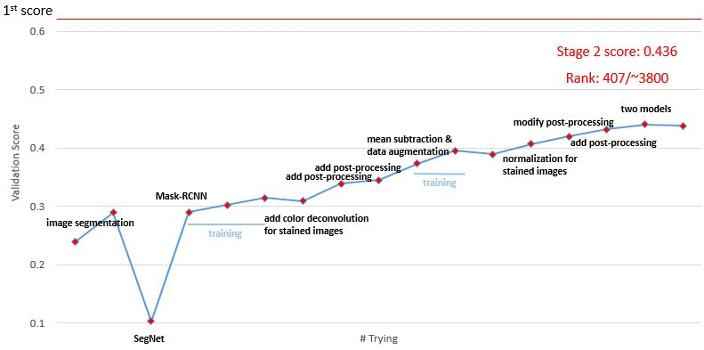

# kaggle_data_science_bowl_2018

This contains our solutions for [2018 data science bowl hold by Kaggle](https://www.kaggle.com/c/data-science-bowl-2018/). The task is to do nuclei segmentation across multiple kinds of cell images.

Our team ranked 407 out of ~3800 teams, with final score 0.436. We first tried basic image segmentation without any deep learning. Then tried "semantic segmentation" [SegNet](http://mi.eng.cam.ac.uk/projects/segnet/tutorial.html), a Fully-Convolutional Neural Network. Finally we implemented [Mask-RCNN](https://github.com/matterport/Mask_RCNN), and got the best score among our tryings. We did not try Unet, which may yield a higher score.

### The repository includes:

* Basic image processing method using watershed (Visualize_data_and_basic_segmentation.ipynb)
* Implementation of Mask-RCNN (Mask_RCNN.ipynb)
* Source code of segmentation functions (segmentationFunctions.py)

### Requirements:

* Python 3
* Common python libraries including numpy, cv2, skimage, etc.
* Download Mask-RCNN from https://github.com/matterport/Mask_RCNN, and add the folder to system path for Mask_RCNN
* Download nuclei images from https://www.kaggle.com/c/data-science-bowl-2018/, and change corresponding paths in the scripts
